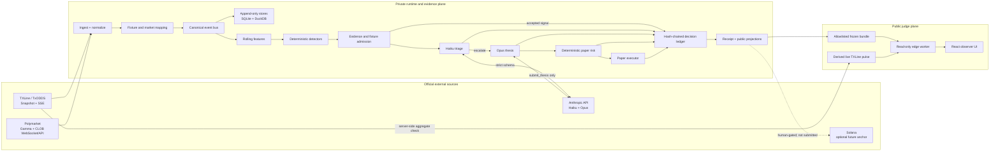
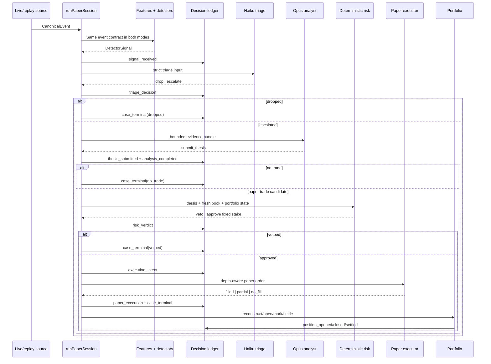
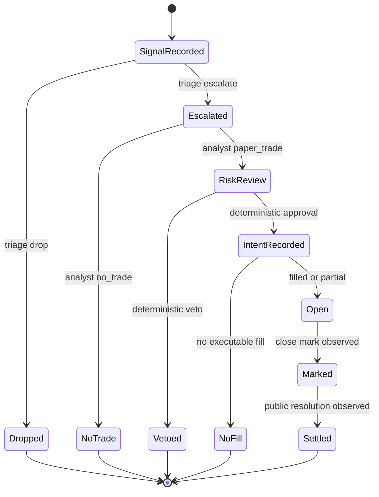
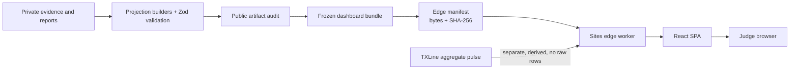

# Samaritan system architecture

**Status:** canonical current-system and UI integration document

**Last reconciled:** July 19, 2026

**Audience:** product, UI, runtime, release, and judge-demo engineers

This document answers two different questions without mixing them:

1. What has actually been built and can be demonstrated today?
2. What is the intended post-bounty architecture but is not yet a product claim?

For visual direction, component styling, and interaction details, use
[`docs/UI.md`](docs/UI.md). For phase gates and future work, use
[`plan.md`](plan.md). The older [`docs/02-architecture.md`](docs/02-architecture.md)
is a useful design thesis, but this file is the source of truth for current
system boundaries and UI data contracts.

## 1. The product in one sentence

Samaritan is a governed, **paper-only** sports-market decision system that turns
official TXLine and Polymarket observations into deterministic signals, lets
Claude make bounded judgments, applies non-overridable code-based risk checks,
simulates execution, and preserves the complete decision trail as verifiable
evidence.

The public site at [getsamaritan.xyz](https://getsamaritan.xyz/) is a read-only
observer for that system. It is not a wallet, an order terminal, or proof that a
24/7 autonomous process is currently trading.

## 2. Status vocabulary

Every architectural claim should fit one of these labels:

| Label | Meaning |
|---|---|
| **Built** | Production TypeScript exists and is covered by the repository's verification path. |
| **Deployed** | The component is running on the public judge deployment. |
| **Evidence** | A frozen artifact demonstrates a bounded claim; its provenance still matters. |
| **Roadmap** | Designed or partially scaffolded, but must not be presented as operating today. |

### Current truth table

| Capability | State | Exact boundary |
|---|---|---|
| TXLine snapshot/SSE ingestion | **Built** | Official API only; credentials remain private. |
| Polymarket discovery, books, prices, and resolution ingestion | **Built** | Official Gamma/CLOB interfaces; no bookmaker scraping. |
| Canonical live/replay event path | **Built** | Both modes feed the same `CanonicalEvent` union and `runPaperSession` conductor. |
| Feature engine and signal detection | **Built** | `CONSENSUS_MOVE`, `XMARKET_DIVERGENCE`, and `FADER_CANDIDATE`; only the locked `CONSENSUS_MOVE` lane is admitted to registered v2 paper review. |
| Claude triage and analyst boundaries | **Built** | Real adapters exist; Haiku emits strict triage and Opus emits a strict thesis. Neither can size or execute. |
| Deterministic paper risk and execution | **Built** | Fixed paper stake and hard gates; not the planned full Kelly/correlation suite. |
| Append-only decision ledger and portable receipt | **Built** | Offline verification works; receipt integrity is local evidence, not provider attestation. |
| Public observer UI | **Deployed** | Frozen derived projections plus a separate aggregate live TXLine pulse. |
| Registered forward v2 study | **Evidence** | Protocol is registered; it currently has zero qualifying observations. Registration is not performance. |
| Spain–Belgium captured replay | **Evidence** | Authentic synchronized retrospective source evidence; it correctly produces a research-only no-trade conclusion. |
| Synthetic full lifecycle | **Evidence** | Shared production components with deterministic Haiku/Opus-shaped stubs and zero external model calls; excluded from performance. |
| Solana anchoring | **Roadmap boundary** | Prepare, human-gated devnet submission, and verification tooling exist; no transaction was submitted for the public receipt. |
| Real-money Polymarket execution | **Roadmap** | No production adapter, credential, signer, or wallet is connected. The gate is closed. |
| Four-persona tournament, Head Trader, MODELER, and Data Doctor | **Roadmap** | Product architecture only; do not render them as live agents. |

## 3. System context



There are deliberately two planes:

- The **private runtime/evidence plane** can ingest licensed data, access private
  credentials, run model calls, write stores, and generate artifacts.
- The **public judge plane** serves only allowlisted derived material. It cannot
  access a wallet, place an order, or re-serve raw TXLine data.

## 4. Non-negotiable authority boundaries

### Claude is judgment, not authority

- Haiku can only return `drop` or `escalate` plus its bounded classification.
- Opus can only return a schema-validated trade thesis. The implemented analyst
  receives a code-assembled evidence bundle and exits through the strict thesis
  contract; the richer pull-tool investigation loop remains roadmap.
- The analyst cannot choose a stake, construct an order, call an execution
  adapter, access a wallet, or override a veto.
- Invalid, missing, mismatched, late, or expired model output fails closed.

### Deterministic code owns risk

The current approved paper configuration is:

| Rule | Value |
|---|---:|
| Paper bankroll | $50.00 |
| Fixed per-trade stake | $3.00 |
| Aggregate open-exposure cap | $15.00 |
| Drawdown stop | $20.00 |
| Minimum raw/executable probability gap | 1 percentage point |
| Maximum book age | 5 seconds |
| Maximum fee-metadata age | 5 minutes |
| Real-money gate | Closed |

All money is stored as integer micro-USD. The risk layer additionally rejects
unapproved detectors/markets, research-only signals, score-contaminated context,
stale or identity-mismatched books, invalid fee metadata, missing inventory for
sells, expired theses, insufficient executable edge, and exposure/drawdown
breaches.

The planned Opus risk judgment pass, quarter-Kelly sizing, correlation controls,
and full manual kill-switch system are not part of the shipped bounty runtime.

### The ledger precedes action

The signal is recorded before model I/O. Triage and thesis outputs are recorded
before downstream review. A risk verdict is recorded before an execution intent,
and the intent is recorded before invoking paper execution. Results are appended
immediately after the corresponding action. Ledger rows are append-only and
hash-linked; they are never rewritten in place.

## 5. Canonical data plane

### Inputs

| Source | Private input | Canonical output |
|---|---|---|
| TXLine | Prices, de-vigged `Pct`, score actions, clock/game state, heartbeats | `odds.quote`, `score.update`, feed events |
| Polymarket | Market metadata, best bid/ask, depth, trades, resolution | `polymarket.price`, `polymarket.book`, `polymarket.resolution` |

Important normalization rules:

- Probabilities are always represented internally on a `0..1` scale.
- Captured TXLine `Pct` is a string on a `0..100` scale and is divided by 100.
- TXLine `Prices` are raw odds multiplied by 1,000.
- Market identity includes fixture, family, period, and `lineMilli`; totals lines
  are not floating-point identifiers.
- Source time and local observation time remain separate. The latency difference
  is part of the evidence, not discarded metadata.
- A Polymarket mapping must carry `candidate`, `verified`, or `rejected` status.
  Unverified mappings cannot silently become executable evidence.

### Canonical event contract

`src/bus/events.ts` defines the only event union accepted by the runtime:

```text
odds.quote
score.update
polymarket.price
polymarket.book
polymarket.resolution
feed.heartbeat | feed.status
```

Live adapters and replay adapters both emit these types. There is no transport
mode flag available to detector logic, so code cannot branch merely because an
event came from a live adapter or replay adapter. This does **not** erase evidence
semantics: sampled historical prices, live books, candidate mappings, and
verified mappings remain explicitly distinguishable and are admitted differently.

### Runtime sequence



The scheduler waits for measured model decision latency and the current venue
placement delay before selecting the book that risk and paper execution may use.
This prevents a replay from pretending an order could use information that was
not yet available.

## 6. Decision state machine and ledger contract

The append-only decision ledger accepts these event kinds:

```text
study_initialized
signal_received
triage_decision
thesis_submitted
analysis_completed
risk_verdict
execution_intent
paper_execution
case_terminal
position_opened
position_closed
position_settled
```



Terminal states are first-class outcomes. `No trade`, `vetoed`, and `no fill`
are not UI errors and must not be hidden merely because capital did not move.

## 7. Component map

| Component | Repository location | Responsibility | Current state |
|---|---|---|---|
| TXLine ingestion | `src/ingest/txline/` | Authenticated snapshots/SSE, normalization, feed status | Built |
| Polymarket ingestion | `src/ingest/polymarket/` | Gamma discovery refresh, books/prices/resolution | Built |
| Mapping registry | `src/mapping/` | Evidence-bearing fixture and market identity | Built |
| Canonical bus | `src/bus/` | Shared event types and live/replay boundary | Built |
| Stores | `src/store/` | Append-only journals, time series, decision ledger | Built |
| Feature engine | `src/features/` | Rolling consensus, CUSUM, divergence, context | Built |
| Detectors | `src/detectors/` | Deterministic signal generation | Built |
| Agent contracts | `src/agents/` | Claude adapters, schemas, spend and invocation evidence | Built, bounded |
| Paper conductor | `src/harness/` | Admission, scheduling, lifecycle orchestration, rehydration | Built |
| Risk | `src/risk/paper.ts` | Final deterministic paper veto/approval | Built |
| Paper execution | `src/exec/paper.ts` | Delay-, fee-, depth-, and tick-aware simulation | Built |
| Portfolio | `src/portfolio/` | Restart-safe positions, marks, settlements, drawdown | Built |
| Proof | `src/proof/` | Receipt generation, schema, independent local verification | Built |
| Chain tooling | `src/chain/` | Prepare, explicitly submit, and verify an anchor | Built tooling; no public anchor submitted |
| Public projections | `src/dash/` | Private-to-public view models and frozen bundles | Built |
| React observer | `apps/dashboard/src/` | Judge-facing read-only experience | Deployed |
| Edge worker | `apps/dashboard/worker/` | Hash-check frozen APIs, pulse, headers, SPA fallback | Deployed |

### Detector availability

| Detector | Code | Registered v2 authority | UI meaning today |
|---|---|---|---|
| `CONSENSUS_MOVE` | Built | Full-time totals may enter bounded pretrade paper review only after every admission gate passes | Active candidate family; zero qualifying forward v2 observations |
| `XMARKET_DIVERGENCE` | Built | Not admitted | Research signal only |
| `FADER_CANDIDATE` | Built | Not admitted | Research signal only |
| `STALE_QUOTE` | Feasibility analysis only | Disabled | Spain–Belgium found zero clean windows; never show as active |
| `MODEL_MARKET_GAP` | Not implemented | None | Roadmap only |

## 8. Evidence model

The UI must keep these evidence classes separate even when they appear on the
same page:

| Evidence class | What it proves | What it does **not** prove |
|---|---|---|
| **Captured replay** | Authentic synchronized source observations can be normalized, replayed, and reconciled. Spain–Belgium contains 18 goal/market feasibility observations and zero clean stale-quote windows. | It did not pass through Claude or execution and is not a profitable trade. |
| **Historical sampled-price research** | The repaired chronological `CONSENSUS_MOVE` candidate justified forward paper review: 38 held-out normalized buy cases across 18 fixtures, with the documented sampled-price proxy result. | It does not establish bid/ask execution, fills, CLV, alpha, or profitability. |
| **Synthetic engineering proof** | The shared conductor can complete signal → judgment stubs → risk → intent → paper fill → close → settlement → receipt deterministically. | It is not a real match, real feed, real Claude invocation, real order, or performance observation. |
| **Registered forward v2 study** | Deborah froze a fresh-forward-only protocol before accepting observations. | Registration alone is not a result; the current qualifying count is zero. |
| **Offline receipt verification** | The disclosed canonical receipt, source references, and hash-linked rows reconcile locally. | It is not an Anthropic attestation, an independent timestamp, or a Solana anchor. |

Each evidence card or case should carry, as applicable:

- evidence class;
- source and observation timestamp;
- execution mode;
- real-money gate state;
- tradeability/admission state;
- verification or reconciliation state;
- whether capital moved;
- whether an external anchor exists.

## 9. Public deployment architecture



- `getsamaritan.xyz` and `www.getsamaritan.xyz` resolve through Vercel-managed
  authoritative DNS. Vercel is the DNS layer, not the application runtime.
- The application is deployed to the Sites edge runtime with a
  Worker-compatible request handler.
- The React application reads frozen public projections. It does not query the
  private SQLite/DuckDB stores or start the paper runtime.
- Each frozen **API response** is allowlisted by an edge manifest. The worker
  verifies its byte count and SHA-256 before serving it; mismatch returns `503`
  rather than partial evidence.
- The optional TXLine pulse uses server-side credentials and exposes only a
  coarse aggregate connectivity result. Its failure does not invalidate frozen
  evidence.
- Pulse caching is per edge-worker isolate and split between configured and
  unconfigured credential scopes. Concurrent refreshes share one request; the
  normal TTL is 60 seconds. A failed refresh may retain only the last aggregate
  count for up to five minutes and must downgrade it to `degraded` + `stale`.
- Static hashed assets are immutable; evidence JSON and HTML are not treated as
  immutable caches.

### Runtime variants

| Variant | Purpose | Data source | Runs the autonomous paper conductor? |
|---|---|---|---|
| Hosted Sites Worker | Public judge deployment | Frozen edge artifacts + aggregate pulse | No |
| Local Node judge server (`pnpm judge`) | Clean-clone judging and local static hosting | Frozen dashboard artifacts by default | No |
| Vite development middleware (`pnpm dash:dev`) | UI development | Same dashboard API handler and frozen artifacts by default | No |
| Private projection builders | Export-time generation | Private stores, reports, and validated evidence | No; they project existing evidence |
| `runPaperSession` runtime | Live/captured paper orchestration | Canonical event sources and private dependencies | Yes; it is separate from the hosted UI |

### Publication and refresh path

The public evidence changes only through an explicit release pipeline:

```text
private evidence
  → projection builders
  → runtime schema validation
  → canonical dashboard JSON + manifest hashes
  → edge bundle
  → public-artifact audit
  → dashboard build/deploy
```

`generatedAt` describes projection generation, not a continuously refreshing
runtime. Only the aggregate TXLine pulse has request-time freshness.

## 10. Current UI route and data map

These are current implementation routes, not a mandate to preserve the internal
names forever. If the UI is restructured, keep aliases or update the route/API
contract and this document together.

| Visible navigation | Browser route | Current component | Primary source | Semantic job |
|---|---|---|---|---|
| **Overview** | `/`, `/command`, and the current unknown non-file SPA fallback | `CommandApp` | `GET /api/v1/command` plus the optional pulse | Frozen system posture, featured captured case, fixture/capture status, study/proof summary |
| **Live match** | `/matchroom` | `MatchroomApp` | `GET /api/v1/matchroom/paired-spain-belgium-2026-07-10` | Manual three-state captured replay and disciplined no-trade explanation |
| **Decisions** | `/casebook` | `CasebookApp` | `GET /api/v1/casebook` | Search/filter the complete 18-observation retrospective corpus |
| **Performance** | `/study` | `StudyApp` | `GET /api/v1/study` | Registered v2 status, sealed stopping-rule output, historical and synthetic boundaries |
| **Architecture** | `/architecture` | `ArchitectureApp` | Static, code-owned explanatory content | Current system boundary, authority split, evidence lanes, and built-versus-roadmap separation |
| **Proof** | `/proof` | `ProofApp` | Direct frozen receipt, command, and manifest artifacts | Browser-side receipt/chain verification plus deployment-trusted captured context |

`ProofApp` currently loads:

```text
/artifacts/dashboard/synthetic-decision-receipt.json
/artifacts/dashboard/command.json
/artifacts/dashboard/manifest.json
```

There is intentionally no `/api/v1/proof` endpoint. The browser independently
recomputes the synthetic receipt commitment, disclosed ledger links, lifecycle
order, provenance boundary, and source-reference relationships. The separately
loaded `command.json` and manifest context are parsed, but the browser does not
currently hash `command.json` against a manifest entry. That captured context is
therefore **deployment-trusted**, not independently browser-verified. Direct
artifact requests also do not pass through the Worker's per-request frozen-API
hash check.

### Public HTTP surface

| Path | Response |
|---|---|
| `/api/v1/command` | `CommandSnapshot` frozen observer projection |
| `/api/v1/matchroom/paired-spain-belgium-2026-07-10` | `MatchroomSnapshot` captured replay projection |
| `/api/v1/casebook` | `CasebookSnapshot` derived decision corpus |
| `/api/v1/study` | `StudySnapshot` protocol/research/proof summary |
| `/api/judge/evidence` | One-call, fail-closed judge evidence summary |
| `/api/v1/txline/pulse` | Separate live aggregate pulse or truthful degraded state |
| `/api/v1/health` | Read-only service health |

Only `GET` and `HEAD` are accepted. Mutation methods return `405`; unknown API
paths return `404`. The browser contract types live in
`src/dash/public-contract.ts`, and the frozen schemas/route definitions live in
`src/dash/public-bundle.ts`.

### Public view models

| View model | Core fields the UI should trust |
|---|---|
| `CommandSnapshot` | `mode`, system posture, feeds, schedule status/source, featured case, study status, proof summary, public policy |
| `MatchroomSnapshot` | captured mode, replay states/chart, decision stages, no-trade reason, corpus proof, public policy |
| `CasebookSnapshot` | corpus counts/commitment, filter options, all cases, selected-case lifecycle and evidence |
| `StudySnapshot` | exact protocol identity, qualifying counts, stopping-rule state, guardrails, corrected historical candidate, synthetic proof boundary |
| Decision receipt | provenance, agent invocation class, ordered lifecycle, disclosed ledger rows, source references, build/config hashes, anchor state |

## 11. UI truth model

A single green/red status is too lossy. The UI should model these dimensions
independently:

| Dimension | Examples |
|---|---|
| Runtime mode | captured replay, frozen artifact, synthetic fixture, live aggregate pulse |
| Evidence class | captured, historical research, synthetic, forward registered, invalidated audit |
| Decision state | no signal, drop, no trade, veto, intent, no fill, filled, settled |
| Execution authority | paper, real-money gate closed, not tradeable |
| Assurance | internally reconciled, locally verified, degraded, unanchored |
| Freshness | observed time, generated time, pulse check time, stale/unknown |

Required fail-closed UI states include:

- loading evidence;
- frozen evidence unavailable;
- receipt reconciliation failed;
- no cases matching filters;
- no qualifying forward observations;
- no signal / no trade / veto / no fill;
- aggregate pulse degraded or stale;
- capture scheduled but not terminally verified;
- capture failed or inadmissible;
- synthetic and performance-excluded;
- locally verified but unanchored.

The UI may hardcode stable presentation copy, route labels, icons, and enum-to-copy
mappings. It must **not** hardcode evidence counts, P&L, hashes, fixture phase,
feed status, study results, gate state, verification state, or claims that a model
or order ran. Those values come from the typed public contract or receipt.

## 12. Public data, legal, and security boundary

- Do not expose or re-serve raw TXLine payloads, rows, fixture IDs, odds series,
  or fair-probability series.
- Public TXLine movement is bucketed derived movement only; the current public
  movement bucket is 25 basis points.
- Samaritan aliases and derived conclusions may be public; source credentials and
  licensed source payloads may not.
- Secrets stay server-side in environment variables or ignored local files.
- No wallet control, signer, order mutation, account control, or payment permission
  exists in the public client.
- The edge applies CSP, same-origin isolation, no-referrer, no-sniff,
  frame-denial, and restrictive browser permission headers.
- Submission language names Deborah as the participant and Claude as a component.
  It must not describe the entry as AI-built.

## 13. Failure handling and operational gaps

| Failure | Runtime behavior | UI behavior |
|---|---|---|
| Missing/invalid TXLine pulse credentials | Return a bounded degraded pulse | Keep frozen evidence available; label only the pulse degraded |
| Frozen file missing or hash/length mismatch | Edge returns `503 evidence_unavailable` | Do not render a partial success state |
| Unverified/rejected mapping | Keep research-only or reject admission | Show mapping/admission state; never imply execution eligibility |
| Stale book, fees, thesis, or identity mismatch | Deterministic risk veto | Show the exact veto family without inventing an order |
| Source gap, incomplete terminal capture, missing resolution | Capture/study admission fails closed | Mark failed/inadmissible; exclude from study counts |
| Ingress overflow or runtime halt | Session terminates affected work and records failure | Show halted/failed, not standing by or live |
| Receipt/source-reference mismatch | Verification fails | Replace proof success with fail-closed proof state |
| No qualifying study evidence | Stopping rule remains unmet; result stays sealed | Show zero-observation truth, not an empty performance chart |
| Upstream pulse succeeds with a degraded payload | HTTP remains `200`; payload carries `status: degraded` | Treat it as an operational state, not a transport error |
| Pulse request itself fails in the browser | Frozen evidence remains valid | Show the pulse unavailable and allow a retry |

### Autonomous session failure contract

The paper conductor has a bounded ingress queue and one ordered mutation path.
It distinguishes failures rather than collapsing them into a generic halt:

| Failure class | Required behavior |
|---|---|
| Canonical source or ingress observer failure | Fail the queue, abort the source, terminate pending cases with an ingress halt reason |
| Queue overflow | Fail closed; record queue high-water/overflow counters in the session summary |
| Ordered runtime failure | Abort source work and terminalize pending cases with a runtime halt reason |
| Source shutdown timeout | Stop the session and report the configured timeout in the failure summary |
| Finite source ends with pending cases | Terminalize pending work and raise a completion-invariant failure |
| Bus/runtime delivery count mismatch | Raise a completion-invariant failure; do not report completion |
| Pre-existing or terminal ledger corruption | Chain verification fails at the session boundary |

The thrown session error carries durable counters, pending-case count, ledger row
count/head hash, queue capacity/high-water/overflow state, shutdown state, and a
classified halt. A UI or operator view must render the classified failure and
must not convert it to `standing_by`.

### Known capture-scheduler defect

On July 19, the unattended France–England capture supervisor remained in a
`scheduled` state past its intended window and produced neither child capture
processes nor terminal artifacts. The current long relative-wait scheduler is
therefore **not sleep/wake-safe and must not be treated as reliable unattended
orchestration**.

Until it is replaced with an absolute-time, wake-safe supervisor with an overdue
terminal state, the UI must treat `scheduled` as intent only. A capture becomes
evidence only after terminal manifests and validation exist.

### Known observer implementation gaps

- `CommandApp` currently treats `status: connected` as connected without also
  enforcing `freshnessClass` or ageing `checkedAt` in the browser. A redesign
  should display connected/stale as distinct states.
- The four frozen snapshot loaders currently TypeScript-cast their JSON after the
  export/edge boundary has validated it; they do not runtime-parse the payload in
  the browser. Pulse and Proof inputs receive stronger client validation. Keep
  the edge as the current trust boundary or add shared browser parsing before
  relying on newly introduced fields.
- Unknown non-file SPA paths currently fall back to Overview. Preserve that
  intentionally or add a truthful not-found route; do not let it happen by
  accident during routing changes.

## 14. Roadmap architecture — never render as active

The following design remains valuable, but it is future state:

1. A multi-step analyst tool loop over as-of evidence instead of the current
   single bounded evidence bundle.
2. A separate risk-manager judgment pass that may only veto or shrink, never
   create or enlarge, followed by full deterministic Kelly/correlation caps and
   Deborah's manual kill switch.
3. Four isolated paper personas—Momentum, Arb, Fader, and Modeler—plus a
   deterministic Head Trader tournament scored by CLV and Brier.
4. The in-play goal model and `MODEL_MARKET_GAP` detector.
5. Evidence-backed activation of `STALE_QUOTE`; the present Spain–Belgium study
   found no clean case, so it remains disabled.
6. A scheduled Data Doctor that may halt but cannot resume trading.
7. A production Polymarket V2 adapter, pre-match only, after the gate study and
   all risk/authority requirements pass.
8. Submitted Solana commitments and independently verifiable inclusion proofs.
9. A continuously hosted private runtime with durable, wake-safe capture and
   operational alerting.

## 15. UI implementation rules

When rebuilding the interface:

1. Read `src/dash/public-contract.ts` before building components. Treat its
   discriminated unions as the state model, and use shared runtime schemas when
   a browser boundary needs stronger validation than a compile-time cast.
2. Keep data loading in route-level adapters and pass parsed view models into
   presentational components. Do not import private stores into the browser.
3. Preserve the six semantic jobs even if navigation, naming, or layout changes:
   overview, captured replay, decision corpus, study truth, architecture, and
   proof.
4. Put provenance next to the claim it qualifies. A global disclaimer is not a
   substitute for per-card evidence labels.
5. Format integer micro-USD only at the display edge. Never calculate money with
   UI floats and write it back as evidence.
6. A word such as `live`, `verified`, `filled`, `anchored`, or `Claude` must be
   backed by a corresponding contract field and timestamp/receipt evidence.
7. Keep no-trade outcomes visually meaningful. Disciplined refusal is a core
   product behavior, not an empty state.
8. Keep the live pulse failure isolated from frozen evidence failure.
9. Preserve keyboard access, reduced-motion behavior, responsive layouts, and
   explicit loading/error/empty states from `docs/UI.md`.
10. Update this file, the public contract, schemas, projections, tests, and frozen
    bundle together whenever a UI change alters the meaning of a claim.

## 16. Source-of-truth hierarchy

When two sources disagree, resolve them in this order and update the stale source
in the same change:

1. Captured real samples for external API shapes (`samples/`, private captures).
2. Runtime schemas, code, and verified frozen artifacts.
3. `AGENTS.md` hard invariants and registered protocol records.
4. This `ARCHITECTURE.md` for built/deployed/UI boundaries.
5. `docs/UI.md` for presentation and interaction design.
6. `plan.md` and `docs/02-architecture.md` for phase sequencing and target design.

Useful verification commands:

```bash
pnpm check
pnpm demo
pnpm receipt:verify -- public/artifacts/dashboard/synthetic-decision-receipt.json
pnpm public:audit
pnpm dash:build
```

The final release gate is `pnpm judge:check`.
